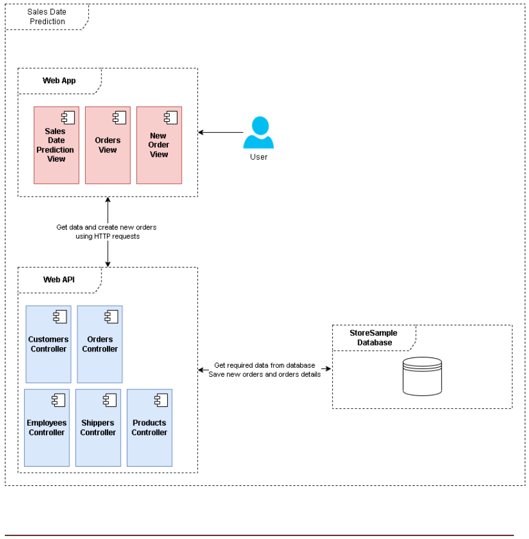
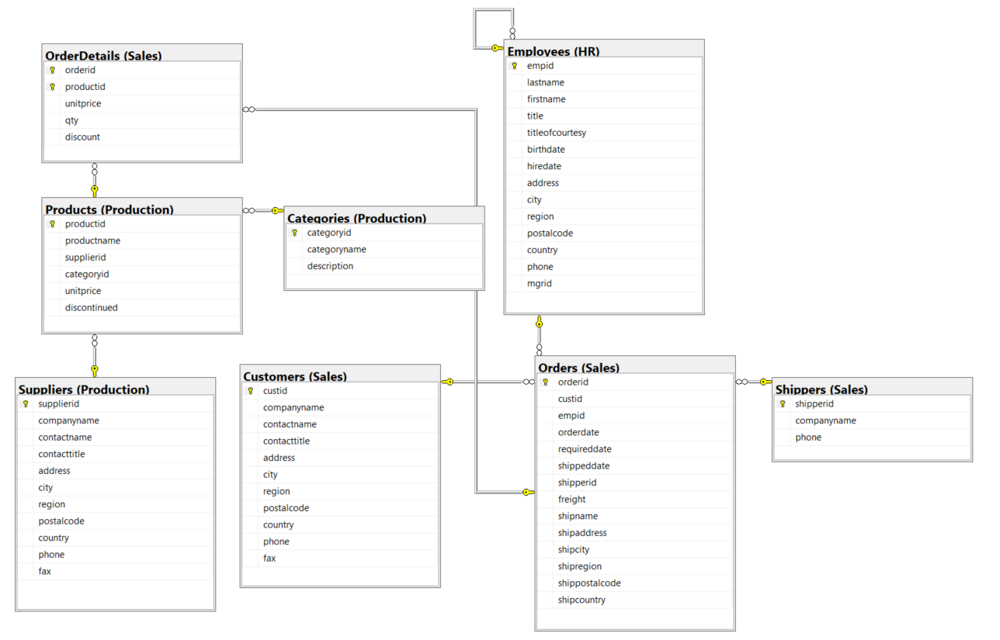

# Prueba Técnica Desarrollador - CODIFICO

# Sales date prediction App
Aplicación web para crear órdenes y predecir cuándo ocurrirá la próxima orden por cliente de acuerdo con los registros almacenados en la base de datos.

### Diagrama de arquitectura


### Modelo ER


## Base de datos
La aplicación requiere construir sentencias DML que serán usadas por el componente de Web API.

>Visualizar queries: [queries.sql](scripts/queries.sql)

### 1. Sales Date Prediction
Crear una consulta que retorne por cliente la fecha de cuando ocurrirá la próxima orden, esta fecha se calcula sumando el promedio de días entre las órdenes existentes del cliente a la fecha de la última orden.
``` SQL
-- Sales Date Prediction
EXEC dbo.PredictNextOrderDate
```
>Visualizar SP: [SP_PredictNextOrderDate.sql](scripts/SP_PredictNextOrderDate.sql)

### 2. Get Client Orders
Crear una consulta que retorne las ordenes de un cliente.
``` SQL
-- Get Client Orders
SELECT o.orderid, o.requireddate, o.shippeddate, o.shipname, o.shipaddress, o.shipcity 
FROM [StoreSample].Sales.Orders o
WHERE o.custid = 1
```

### 2. Get employees
Crear una consulta que retorne todos los empleados
``` SQL
-- Get employees
SELECT e.empid, CONCAT(e.firstname, ' ', e.lastname) AS FullName
FROM [StoreSample].HR.Employees e
```

### 3. Get Shippers
Crear una consulta que retorne todos los transportistas
``` SQL
-- Get Shippers
SELECT s.shipperid, s.companyname
FROM [StoreSample].Sales.Shippers s
```

### 4. Get Products
Crear una consulta que retorne todos los productos
``` SQL
-- Get Products
SELECT p.productid, p.productname
FROM [StoreSample].Production.Products p
```

### 5. Add New Order
Crear un script usando Transact SQL que permita ingresar una nueva orden y agregar un producto
``` SQL
-- Add New Order
EXEC dbo.AddNewOrder 
    @EmpId = 1,
    @ShipperId = 2,
    @ShipName = 'Fast Shipping',
    @ShipAddress = '123 Main St',
    @ShipCity = 'New York',
    @ShipCountry = 'USA',
    @OrderDate = '2024-09-18',
    @RequiredDate = '2024-09-25',
    @ShippedDate = '2024-09-19',
    @Freight = 50.00,
    @ProductId = 10,
    @UnitPrice = 10.50,
    @Qty = 5,
    @Discount = 0.10;
```
>Visualizar SP: [SP_AddNewOrder.sql](scripts/SP_AddNewOrder.sql)

---
## Sales Date Prediction API
Web API desarrollada en .NET Core que permite gestionar y consultar órdenes de clientes, con un enfoque en predecir la próxima fecha de pedido de cada cliente. 

Diseñada con arquitectura hexagonal y documentada utilizando Swagger, lo que facilita la visualización y prueba de los puntos de conexión disponibles.

>[Ir a SalesDatePrediction](SalesDatePrediction/)

### Requisitos previos

- .NET 8 version
- Sql Server

> Configure la cadena de conexión de Azure SQL DB en el archivo appsettings.json. Reemplace <server> por el nombre del servidor de base de datos.

```json
"ConnectionStrings": {
  "StringConnection": "Data Source=<server>;Initial Catalog=StoreSample;Integrated Security=True;Trust Server Certificate=True",
  "SchemaName": "dbo"
},
```

### Project build
Para compilar y preparar el proyecto para su ejecución, siga estos pasos:

1. Asegúrese de tener instalado el SDK de .NET en su equipo.
2. Desde la raíz del proyecto, ejecute el siguiente comando para restaurar las dependencias:

```bash
dotnet restore
```

3. Ejecute el siguiente comando para compilar el proyecto:

```bash
dotnet build
```

### Pruebas unitarias con XUnit
Este proyecto incluye pruebas unitarias con XUnit.

Para ejecutar las pruebas unitarias, siga los pasos que se indican a continuación:

1. Asegúrese de tener el SDK de .NET y Docker instalados en su equipo.
2. Desde la raíz del proyecto, ejecute el siguiente comando para compilar el proyecto y las pruebas:

```bash
dotnet build
```

3. Ejecute el siguiente comando para ejecutar las pruebas unitarias:

```bash
dotnet test
```

---
## Sales Date Prediction Web App
Aplicación web desarrollada en Angular que permite gestionar y consultar órdenes de clientes, con una funcionalidad adicional para predecir la próxima fecha de pedido de cada cliente.

>[Ir a SalesDatePredictionWebApp](SalesDatePredictionWebApp/)


### Requisitos previos

- Angular 17

> Configure la URL de la API en el archivo de entorno, específicamente en el campo `apiServerURL`.

### Build
Para compilar y preparar el proyecto para su ejecución, siga estos pasos:

1. Asegúrese de estar en la raíz del proyecto y ejecute el siguiente comando para instalar todas las dependencias necesarias:

```bash
npm install
```

2. Desde la raíz del proyecto, ejecute el siguiente comando para iniciar la aplicación. Esta se recargará automáticamente cuando detecte cambios en los archivos de origen. Acceda a la aplicación desde http://localhost:4200/:

```bash
ng serve
```


---
## Graficando con D3
Este proyecto es una aplicación frontend simple que permite crear un gráfico de barras horizontales utilizando la librería D3.js. El usuario puede ingresar datos numéricos en un campo de texto, y la aplicación generará un gráfico dinámico en base a esos datos.

>[Ir a Graph.sql](Graph/)